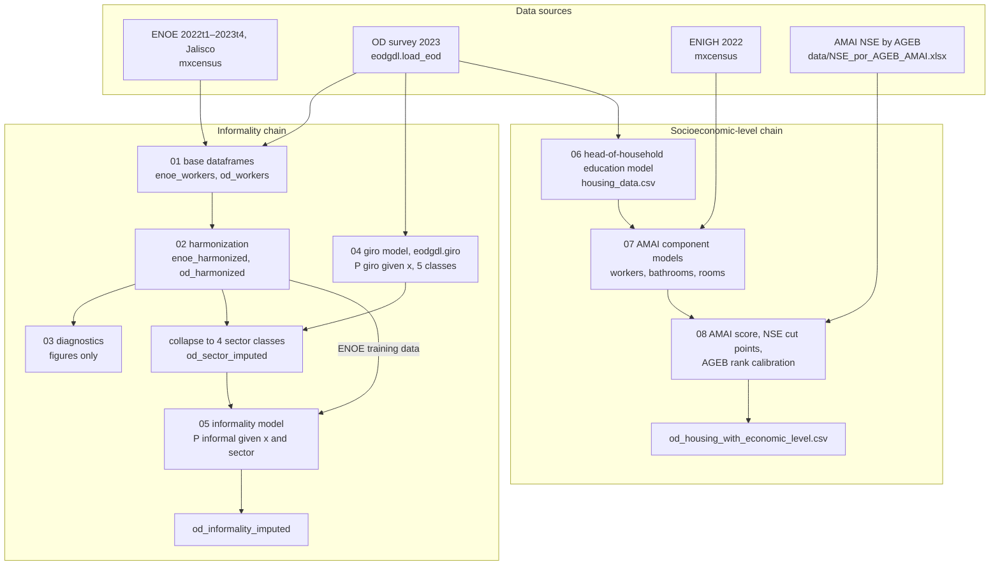

> **Archived (2026-09-28).** These models now live in [eodgdl](https://github.com/CentroFuturoCiudades/eodgdl)'s imputation
> engine, `eodgdl.impute` (v0.4.0+): the tasks `informality`, `educacion_jefe`, `amai_banos` and `amai_dormitorios`, and the
> chains `sector_informality` (giro → informality) and `nse`, run with `eodgdl impute score | retrain | evaluate`. The
> figures of these notebooks are redrawn from eodgdl's outputs by its `reports/imputation_figures.qmd`. This repository
> is kept, read-only, for its history.

<div align="center">

# Classification Model for Formal and Informal Jobs

This repository builds two worker- and household-level estimates for the Guadalajara Metropolitan Area Origin-Destination (OD) survey (IMEPLAN, 2023), neither of which the survey records:

- **informal employment** for every OD worker, from models trained on ENOE (INEGI's labour survey, which has an informality label), after harmonizing the two surveys and imputing the economic activity most OD workers did not report;
- the **AMAI socioeconomic level (NSE)** of every OD dwelling, from AMAI's household score, whose missing components are imputed from the OD itself and from ENIGH 2022, then calibrated to AMAI's published NSE distribution by AGEB.

</div>

## 1. Pipeline overview

The work is split into eight numbered notebooks plus a plotting notebook. The notebooks hold orchestration, printing and plotting; the reusable logic of stages 1–5 is the installable package `informal_jobs_model` (`src/informal_jobs_model/`, imported as `ijm`). Stages 6–8 still keep their logic in the notebook cells.

There are two independent chains. The informality chain (01–05) and the socioeconomic-level chain (06–08) both start from the OD tables served by `eodgdl`, but neither reads the other's outputs.



### 1.1 Models

Every model is a probabilistic scikit-learn classifier. Its output is carried downstream as a full probability vector (or as the expected score it implies), never as a hard class. Model selection uses survey-weighted log loss under household- or dwelling-grouped cross-validation. Each chain also handles a covariate that is often missing in the OD with a *hybrid* pair of models: one uses the covariate, the other does without it, and each row is scored by the model that matches it.

| # | Model | Stage | Trained on | Target | Hybrid split | Applied to | Feeds |
|---|---|---|---|---|---|---|---|
| 1 | Giro (employer activity) | 04, trained in eodgdl | OD workers with an observed `giro_empresa` | 5 native giro levels | education observed / missing | OD workers | informality model, via the 4 harmonized sector classes |
| 1a | ↳ destination model | inside the giro bundle | OD workers with a work trip | work-trip destination type | same | OD workers without a work trip | giro model (marginalizes the destination) |
| 2 | Informality | 05 | ENOE workers, whole of Jalisco, 8 pooled quarters | `informal` (INEGI `emp_ppal`) | education observed / missing | OD workers, marginalizing over sector | `od_informality_imputed` |
| 2a | ↳ place-of-work model | 05, in the informality bundle | the same ENOE workers | `lugar_trabajo` | same | OD workers without a work trip | informality model (marginalizes the place of work) |
| 3 | Head-of-household education | 06 | OD heads of household with known education | 7 AMAI education categories | — | OD heads with missing education | expected AMAI education score, then a predictor of model 4 |
| 4 | AMAI components (3 targets × 2) | 07 | ENIGH 2022 households | workers aged 14+, complete bathrooms, bedrooms (AMAI categories) | household income observed / missing | OD dwellings | expected AMAI component scores |
| 5 | NSE assignment and calibration | 08 | not fitted: AMAI cut points, then a weighted rank calibration to AMAI's AGEB distribution | 7 NSE levels | — | OD dwellings | `od_housing_with_economic_level.csv` |

How the models are chained:

1. **Giro → sector → informality.** The giro model returns `prob_giro_<slug>` for the five OD activity levels. `ijm.attach_sector_probabilities` collapses them into the four harmonized sector classes the informality model was trained on (`prob_sector_*`; the map is many-to-one, so the collapse loses nothing). The informality model is then evaluated under every sector, and the results are combined:

   $$P(I_i=1\mid X_i)=\sum_s P(I_i=1\mid X_i,S_i=s)\,P(S_i=s\mid X_i).$$

   Workers whose sector is observed have a one-hot `prob_sector_*` vector, so for them the sum reduces to a single term.
2. **Auxiliary models for unobserved predictors.** The place of work (`lugar_trabajo`) and the giro model's work-trip destination come from the OD trip table, so workers who made no work trip on the survey day have neither. Instead of scoring them with a missing value, the informality and giro predictions average over the levels of that feature, weighted by the auxiliary model's P(level | x). A categorical level with no training support (and the missing label `no_especificado`) is marginalized the same way over the supported levels. The `*_marginalized_features` output columns record which rows and features this touched.
3. **Education → AMAI components → NSE.** Notebook 06 converts the head of household's education (observed, or imputed by model 3) into the expected AMAI education score. Notebook 07 uses that score as the `educacion_jefe` predictor of the ENIGH-trained component models. The component probabilities become expected scores, and notebook 08 adds the six component scores (education, Internet and cars observed or imputed in 06; workers, bathrooms and bedrooms imputed in 07) into the household AMAI score.

## 2. Setup and running

Dependencies are managed with [uv](https://docs.astral.sh/uv/) (Python ≥ 3.13):

```bash
uv sync                  # create .venv with the locked dependencies and install informal_jobs_model (editable)
uv run jupyter lab       # run the notebooks in order: 01 → 05, then 06 → 08 (the two chains are independent)
```

To run one notebook headless:

```bash
uv run jupyter nbconvert --to notebook --execute notebooks/05_informality_model.ipynb --inplace
```

Notes:

- Each notebook reads the previous stage's files from `outputs/` (gitignored; everything in it is regenerated). Paths are anchored to the repository root, so notebooks run from the root or from `notebooks/`.
- Notebooks 03–05 render figures with LaTeX (`mpl.rc("text", usetex=True)`), so a LaTeX installation is required, or disable that line locally.
- Stages 4 and 5 tune three model families with grouped cross-validation and are slow.
- The `.joblib` bundles are scikit-learn pickles and only load reliably with the scikit-learn version in `uv.lock`.
- `uv run python -m informal_jobs_model <reference_dir> outputs [--stage 1|2|models|all]` compares a run against a reference copy of `outputs/`: row counts, key overlap, weighted totals, harmonized distributions and informality rates.

## 3. Data

The survey data are loaded through the project's data packages, which download and cache the raw tables on first use, so no survey files are stored in this repository. Both packages are git dependencies pinned in `pyproject.toml` (`mxcensus` v0.4.0; `eodgdl` on its `giro-model` branch until the giro model is released). The caches live under `~/Library/Caches/mxcensus` and `~/Library/Caches/eodgdl` (override with `MXCENSUS_CACHE_DIR`, `EODGDL_CACHE_DIR`).

- **ENOE** (Encuesta Nacional de Ocupación y Empleo, INEGI) via [`mxcensus`](https://github.com/CentroFuturoCiudades/mxcensus). `mxcensus.load_enoe_persons(period=..., ent=14)` returns the sociodemographic roster (SDEM) joined with the two occupation questionnaires (COE1, COE2) for one quarter, restricted to Jalisco.
  - The pipeline pools the eight quarters 2022-T1 to 2023-T4 (`ijm.ENOE_PERIODS`, ~50k workers). Survey weights are divided by the number of quarters, so totals stay at the average quarterly population. Panel visits are grouped by the cross-quarter household key.
  - 2023-T1 is the reference quarter; it matches the OD fieldwork.
  - The pipeline keeps these columns (`ijm.ENOE_OUTPUT_COLUMNS`):
    - `tipo`, `mes_cal`, `cd_a`, `ent`, `con`, `v_sel`, `n_hog`, `h_mud`, `n_ren`: dwelling, household and person identifiers
    - `mun`: municipality
    - `survey_weight` (`fac_tri`), `survey_stratum` (`est_d_tri`, sampling-design stratum), `survey_psu` (`upm`): survey design variables; `estrato_socioeconomico` (`est`) is INEGI's socio-economic stratum
    - `sex`: gender
    - `eda`: age
    - `cs_p13_1`: educational level
    - `e_con`: marital status
    - `par_c`: relationship to the head of household
    - `pos_ocu`: position in the occupation
    - `scian`: economic sector (SCIAN grouping)
    - `p4`, `p4b`, `p4e`, `p4f`, `p4h`: place-of-work items (COE1 section IV), harmonized into `lugar_trabajo`
    - `emp_ppal`: formal or informal employment status, used as the target variable for training the models
    - `tue2`, `seg_soc`: type of economic unit and access to social security, which split the informality label into its informal-sector and unprotected components (diagnostic only)
    - `dwelling_size`: number of persons in the dwelling, counted over the full SDEM roster

- **Origin–Destination Survey** (IMEPLAN, Guadalajara Metropolitan Area, 2023) via [`eodgdl`](https://github.com/CentroFuturoCiudades/eodgdl). `eodgdl.load_eod()` returns dwellings (`viv`), persons (`hab`), trips and trip legs with snake_case column names. The informality chain joins persons with their dwelling attributes and keeps every person column; the ones used downstream are:
    - `folio_vivienda`, `folio_habitante`: dwelling and person identifiers
    - `expansion_factor` (`ponderador`): person-level survey expansion factor
    - `sexo_nacimiento`: gender
    - `edad`: age
    - `escolaridad_raw`: educational level
    - `estado_civil_raw`: marital status
    - `parentesco_raw`: relationship to the head of household
    - `ocupacion_raw`: occupation / employment position
    - `trabajo_semana_pasada`: employment status last week (used to select workers)
    - `giro_empresa`: economic sector of the employer (missing for most workers)
    - `municipio_raw`, `ageb`, `centralidad`: dwelling geography (from `viv`)
    - `destino_trabajo`, `destino_cvegeo`, `destino_zona`: type, INEGI code and zone of the most frequent work-trip destination, from the trips table. The destination's ámbito and DENUE establishment mix are computed inside the giro model (see 4.4).
    - `dwelling_size` (`personas_en_vivienda`): household size category

  Raw OD columns whose `eodgdl` names coincide with the harmonized attributes created in stage 2 (`ocupacion`, `escolaridad`, `municipio`, `estado_civil`, `parentesco`) carry a `_raw` suffix (`ijm.OD_RAW_COLUMN_RENAMES`); the unsuffixed name always refers to the harmonized attribute. The socioeconomic-level chain (06–08) reads `eodgdl.load_eod()` directly and uses the survey's own column names.

- **ENIGH 2022** (Encuesta Nacional de Ingresos y Gastos de los Hogares, INEGI, national sample) via `mxcensus` (`load_enigh_hogares`, `load_enigh_personas`, `load_enigh_viviendas` and the household questionnaire `load_enigh(table="hogares")`). It is used only by notebook 07, to train the AMAI component models.

- **In-repository inputs** (`data/`), both used only by notebook 08:
  - `NSE_por_AGEB_AMAI.xlsx`: AMAI's count of dwellings by socioeconomic level and AGEB.
  - `GUADALAJARA_SHP/`: AGEB polygons, used only to draw the calibration maps.

## 4. Methodology: informality chain

The OD survey does not identify informal employment, so it is estimated from ENOE through the variables the two surveys share. The unit of analysis is the employed individual in both sources.

### 4.1 Base dataframes
The ENOE and OD tables are loaded through `mxcensus` and `eodgdl` and filtered to employed persons in Jalisco.

- **ENOE.** Workers are INEGI's employed population (`clase2 == 1`: worked in the reference week, or had a job and was temporarily absent) within the survey's analytical universe: definitive interview (`r_def == 0`), habitual or new residents (`c_res in {1, 3}`), ages 12 to 98. INEGI reports employment for ages 15+; the floor is lowered to 12 because the OD survey records working 12–14 year olds. Household size is counted from the dwelling identifiers.
- **OD.** Household size comes from the dwelling table, and the work-trip destination from the trips table.

Stage-1 settings live in `src/informal_jobs_model/config/enoe.yaml` and `od.yaml`: pooled quarters, identifier keys, output columns, renames, OD employment categories and DENUE release.

**Notebook**: `01_generate_enoe_od_base_dataframes.ipynb`
**Module:** `generate_enoe_od_dataframes.py`

### 4.2 Harmonization
This stage maps both surveys onto a common set of attributes with Spanish names:

- `genero`, `ocupacion`, `edad_num`, `escolaridad`, `municipio`, `estado_civil`, `parentesco`, `tamano_viv_cat`, `sector`;
- `lugar_trabajo`, the place of work: from the ENOE workplace questions, and from the OD work-trip destination.

It also standardizes the ENOE informality label (and its informal-sector / unprotected components). Missing or unknown values use the literal category `no_especificado`. The stage fails loudly on any source category that is not mapped. The mapping targets and cut points live in `config/harmonization.yaml` and `mappings/*.yaml`.

**Notebook**: `02_harmonize_enoe_od.ipynb`
**Module:** `harmonize_enoe_od_dataframes.py`

### 4.3 ENOE–OD diagnostics
After both surveys are restricted to the metro municipalities sampled by both, this stage compares:

- the weighted distributions of the harmonized attributes;
- the informality profile across predictor categories in ENOE;
- the missingness of each attribute in the two surveys;
- the distribution of known sectors.

**Notebook**: `03_diagnose_enoe_od_dataframes.ipynb`
**Module:** `diagnose_enoe_od_dataframes.py`

### 4.4 Economic activity (giro) imputation
Most OD workers did not report the activity of their employer (`giro_empresa`). The `eodgdl.giro` subpackage of [`eodgdl`](https://github.com/CentroFuturoCiudades/eodgdl) (extra `eodgdl[giro]`) imputes it **within the OD survey and in the survey's own terms**; nothing in it depends on ENOE, which is why it lives in the survey package.

- **Predictors:** raw survey columns (sex, age, education, municipality, marital status, relationship, dwelling size, occupation, employment status, dwelling centrality, the work-trip destination type and mode, weekend work travel, household vehicles), plus the destination's ámbito and DENUE establishment mix (fetched through `mxcensus`).
- **Target:** the five native giro levels (Comercio, Servicio, Educación, Industria, Gobierno/sector público).
- **Selection:** three classifiers (Logistic Regression, Random Forest, Histogram Gradient Boosting) are tuned under household-grouped cross-validation with a one-standard-error selection rule.
- **Hybrid:** the with-education and without-education specifications are combined by whether education is observed.
- **Workers without a work trip:** their destination type is marginalized with the auxiliary model P(destination | x).
- **Output:** the full probability vector `prob_giro_<giro>`; `giro_final` (the arg-max) is only a convenience.

Training, validation and calibration are documented in eodgdl's `notebooks/giro_model.ipynb`. Notebook 04 only scores the survey with the fitted bundle served by eodgdl (`giro.load_model()`) and collapses the result to the four harmonized sector classes with `ijm.attach_sector_probabilities`, using the many-to-one map `sector.yaml` `od_giro`:

- Comercio → `comercio`
- Servicio and Educación → `servicios_transporte`
- Industria → `manufactura_construccion`
- Gobierno → `gobierno_otro_agricultura`

The imputation assumes that, conditional on the predictors, workers who did not report a giro are distributed like workers who did (missing at random given the covariates). The two populations differ: non-respondents are more educated, and their missing giro co-occurs with other item non-response. Notebook 04 therefore also scores two sensitivity scenarios computed with `eodgdl.giro`:

- a refit on training rows reweighted to the non-respondent profile;
- a delta adjustment of the rare `gobierno` class to its observed share.

Notebook 05 reports the informality headline under each scenario. The shipped outputs use the unadjusted imputation.

**Notebook**: `04_impute_economic_sector.ipynb`
**Module:** `eodgdl.giro` (in the eodgdl package); `attach_sector_probabilities` in `harmonize_enoe_od_dataframes.py`

### 4.5 Informality classification
The informality model learns $P(I=1\mid X,S)$ from ENOE and applies it to the OD, marginalizing over the sector probabilities of 4.4 (see 1.1).

- **Training population:** all labelled ENOE workers in Jalisco across the eight pooled quarters. Non-metro municipalities enter as `municipio = "otro"`.
- **Benchmark geography:** the metro municipalities sampled by both surveys. OD workers in metro municipalities ENOE did not sample (Juanacatlán, Zapotlanejo) are scored by averaging over the sampled ones, and keep their real municipality in the output.
- **Features:** listed in `config/models.yaml` (`informality.features`): `genero`, `ocupacion`, `edad_num`, `escolaridad`, `municipio`, `estado_civil`, `parentesco`, `tamano_viv_cat`, `sector`, `lugar_trabajo`.
- **Tuning:** Logistic Regression, Random Forest and Gradient Boosting (native categorical splits) are tuned under `StratifiedGroupKFold` grouped by the cross-quarter household key, with normalized survey weights. The family is chosen by weighted log loss with a one-standard-error rule, and evaluated once on a held-out set of metro households.
- **Hybrid:** Model A (with education) scores OD workers whose education is observed; Model B (the robust specification without `escolaridad`) scores the rest. Model B is additionally validated on held-out ENOE rows reweighted to the covariate profile of the OD workers with missing education.
- **Place of work:** workers without a work trip have no `lugar_trabajo`; it is marginalized with the auxiliary P(`lugar_trabajo` | x) models (`workplace_models` in the bundle).
- **Calibration:** an isotonic-recalibrated variant is fitted and compared side by side on the same scoring path. The uncalibrated variant is shipped (`SHIP_CALIBRATED = False`).
- **Output:** `prob_informal` is the primary output; the population estimate is its weighted mean. `informal_sampled` is one Bernoulli draw per worker, which is unbiased for weighted aggregates. `informal_predicted` (0.5 threshold) is kept for convenience but is not an estimate of informality: it shrinks toward the majority class and understates the rate by more than ten percentage points.

The notebook also includes these diagnostics, none of which change the shipped outputs:

- the headline under the two giro sensitivity scenarios;
- a two-component decomposition: informal-sector employment (`tue2` 5–7), which the shared covariates largely identify, versus unprotected employment in other units, which rests on the ENOE prior;
- a decomposition of the ENOE–OD gap into model bias, composition and a residual;
- the OD raked to the ENOE metro profile.

ENOE 2023-T1 (January–March) and the OD fieldwork (23 January–29 April 2023) cover the same period.

**Notebook**: `05_informality_model.ipynb`
**Module:** `informality_model.py` (shared machinery such as marginalization, grouped CV, the one-SE rule and calibration is in `common.py`)

`informal_job_plots.ipynb` redraws presentation versions of the stage 4–5 figures from the stage-5 outputs.

## 5. Methodology: socioeconomic-level chain

The AMAI NSE rule (2022 questionnaire) scores six household components and maps the total to seven levels: E, D, D+, C−, C, C+, A/B. The OD records some components directly and others not at all. The chain imputes the missing components probabilistically and carries them as **expected scores** $\widehat S_h=\sum_k \hat p_{hk}\,s_k$, so imputation uncertainty is not collapsed to a single category.

| AMAI component | Source in the OD | Stage |
|---|---|---|
| Head of household's education | observed, or imputed by model 3 | 06 |
| Internet access | observed (`tiene_internet`) | 06 |
| Cars or trucks | observed (`n_autos_camionetas`) | 06 |
| Members aged 14+ who worked last month | imputed from ENIGH (model 4) | 07 |
| Complete bathrooms | imputed from ENIGH (model 4) | 07 |
| Bedrooms | imputed from ENIGH (model 4) | 07 |

### 5.1 Head-of-household education (notebook 06)
Every OD dwelling gets at least one head of household. Where none is reported, the oldest inhabitant is assigned, and `jefe_hogar_fuente` records whether the head was observed or assigned. The head's OD education is mapped to the AMAI categories; about 21% of heads remain without one.

**Model:** a multiclass classifier trained on the heads with known education.

- **Candidates:** Logistic Regression, Random Forest and Gradient Boosting, each tried on three feature sets:
  - demographic and household attributes;
  - the same plus weekend mobility;
  - the same plus centrality and AGEB.
- **Selection:** 5-fold `StratifiedGroupKFold` grouped by dwelling, OD person weights, weighted log loss, then a final evaluation on a held-out 20%.
- **Scoring:** it imputes the probabilities of the 7 education categories for the heads with missing education.

Observed heads get a one-hot vector. The expected education score (`modelo_puntos_ultimo_estudio_jefe_hogar`) is propagated to the dwelling table, together with the Internet and vehicle scores.

**Outputs:** `outputs/files/od_population.csv`, `head_household_education_level_data.csv`, `housing_data.csv`, `outputs/models/head_household_education_model.joblib`.

### 5.2 AMAI components from ENIGH (notebook 07)
The three targets are built in ENIGH 2022 at the AMAI category level:

- household members aged 14 or older who worked last month: 0, 1, 2, 3, 4+;
- complete bathrooms: 0, 1, 2+;
- bedrooms: 1, 2, 3, 4+.

The predictors are harmonized between ENIGH and the OD: household size, monthly household income (ENIGH quarterly income / 3, binned like the OD), the head's AMAI education score (from 06 on the OD side), Internet, cars, motorcycles, bicycles, tenure, and the head's age and sex.

Household income is missing for about 58% of OD dwellings, so each target has a hybrid pair: one model with income and one without, dispatched by whether income is observed. That makes six pipelines. Model family and feature set (base / extended) are chosen by weighted log loss under 5-fold `StratifiedGroupKFold` grouped by ENIGH dwelling (`folioviv`), hyperparameters are tuned, and each pipeline is evaluated once on a held-out 20% and refit on all labelled ENIGH households. The OD dwellings get class probabilities and the expected AMAI score of each component.

**Outputs:** `outputs/files/od_housing_amai_imputed.csv`, `outputs/models/amai_imputation_models.joblib`.

### 5.3 NSE and spatial calibration (notebook 08)
The six component scores are added into the household AMAI score. AMAI's cut points map that score to an initial level, `nivel_socioeconomico_amai`:

| Level | AMAI score |
|---|---|
| E | < 48 |
| D | 48–94 |
| D+ | 95–115 |
| C− | 116–140 |
| C | 141–167 |
| C+ | 168–201 |
| A/B | ≥ 202 |

The initial level is then calibrated to AMAI's published NSE distribution by AGEB (`data/NSE_por_AGEB_AMAI.xlsx`, restricted to the study municipalities). Within each AGEB, the dwellings are ordered by their AMAI score. Each dwelling gets a weighted mid-rank, and the level is read off the AGEB's cumulative NSE distribution. This yields `nivel_socioeconomico_amai_calibrado`: the household score decides the order within the AGEB, and the external distribution decides the composition. Dwellings without a usable urban AGEB match keep their initial level. The notebook maps the predominant level per AGEB (external, before, after) and compares the aggregate distributions over the common AGEBs.

**Outputs:** `outputs/files/od_housing_with_economic_level.csv` (final dwelling-level NSE), `nse_ageb_jalisco.csv` (the processed AGEB reference).

## 6. Outputs

Everything is written under `outputs/` (gitignored) and regenerated by the notebooks.

### 6.1 Datasets

| Output | Stage | Description |
|---|---|---|
| `outputs/enoe_workers.parquet` | 01 | Employed ENOE workers, pooled quarters, before harmonization. |
| `outputs/od_workers.parquet` | 01 | Employed OD workers with dwelling attributes and work-trip destination. |
| `outputs/enoe_harmonized.parquet` | 02 | ENOE workers with the harmonized attributes and the informality label. |
| `outputs/od_harmonized.parquet` | 02 | OD workers with the harmonized attributes. |
| `outputs/od_giro_imputed.parquet` | 04 | Output of the OD giro model: keys, `giro_*` bookkeeping columns and `prob_giro_<giro>` for the five native giro levels. |
| `outputs/od_sector_imputed.parquet` | 04 | `od_harmonized` joined with the giro output collapsed to the four harmonized sector classes (`prob_sector_*`, `sector_final`); the input of the informality stage. |
| `outputs/od_sector_imputed_sensitivity.parquet` | 04 | The same frame under the two giro sensitivity scenarios (`scenario` = `shift_weighted`, `delta_adjusted`). |
| `outputs/od_informality_imputed.parquet` | 05 | **Final informality output:** `prob_informal`, `informal_sampled`, `informal_predicted` and the scoring bookkeeping for every OD worker. |
| `outputs/calibration_{with_education,without_education,hybrid}.parquet` | 05 | Held-out reliability tables of the informality models (read by `informal_job_plots.ipynb`). |
| `outputs/files/od_population.csv` | 06 | Full OD person table with the head-of-household education model outputs. |
| `outputs/files/head_household_education_level_data.csv` | 06 | Heads of household: identifiers, education predictors, class probabilities and AMAI education scores. |
| `outputs/files/housing_data.csv` | 06 | OD dwellings with the education, Internet and vehicle AMAI scores. |
| `outputs/files/od_housing_amai_imputed.csv` | 07 | `housing_data` plus the class probabilities and expected scores of the three ENIGH-imputed components. |
| `outputs/files/od_housing_with_economic_level.csv` | 08 | **Final NSE output:** total AMAI score, `nivel_socioeconomico_amai` and `nivel_socioeconomico_amai_calibrado` for every OD dwelling. |
| `outputs/files/nse_ageb_jalisco.csv` | 08 | Processed AMAI NSE distribution by AGEB used for the calibration. |

### 6.2 Model bundles

| Bundle | Stage | Contents |
|---|---|---|
| eodgdl's `od_giro_hybrid_model.joblib` (`eodgdl.giro.load_model()`) | trained in eodgdl, used in 04 | `model_with_education`, `model_without_education`, their feature lists, `category_levels`, `giro_classes`/`giro_labels`, `destination_models`, `metadata`. |
| `outputs/models/informality_hybrid_model.joblib` | 05 | `model_with_education`, `model_without_education`, `features_with_education`, `features_without_education`, `sector_classes`, `category_levels`, `training_municipalities`, `workplace_models`, `metadata` (selected hyperparameters, test metrics, ENOE periods, shipped variant, scikit-learn version). |
| `outputs/models/head_household_education_model.joblib` | 06 | `pipeline`, `model_name`, `parameters`, `features`, `target`, `education_score_mapping`, `probability_column_mapping`. |
| `outputs/models/amai_imputation_models.joblib` | 07 | `pipelines` (six, keyed by target and income scenario), `targets`, `feature_sets`, `best_tuning_results`, `weight_column`, `probability_column_mappings`, `score_mappings`. |

### 6.3 Figures

Figures are written to `outputs/figures/` as PDF and 600-dpi PNG:

- `weighted_distribution_comparison` (03): weighted predictor distributions in ENOE and OD.
- `informality_profiles` (03): weighted ENOE informality across the harmonized predictors.
- `sector_comparison` (03): known-sector distributions in ENOE and OD.
- `informality_calibration` (05): reliability diagrams of the informality models on held-out ENOE data.
- `informality_model_enoe_od_comparison` (05): ENOE vs OD informality, overall, by calibration and by sector.
- `sector_original_vs_modelo`, `informality_model_enoe_od_comparison_presentation` (`informal_job_plots.ipynb`): presentation versions.
- `education_imputation_model_results` (06): observed vs modelled education distribution and AMAI education scores.
- `nse_spatial_calibration_results` (08): predominant NSE by AGEB (AMAI, before and after calibration) and aggregate distributions.

The giro model's own diagnostics (known vs unknown profiles, imputed distributions, confidence) are produced in eodgdl's `notebooks/giro_model.ipynb`.

## 7. Usage

### 7.1 Informality for new workers

Scoring new workers needs the harmonized attributes of 4.2, with the categories established in stage 2:

- `genero`: sex at birth in both surveys. The OD also records `genero_identidad`, which is not used, so that the attribute matches ENOE.
- `ocupacion`, `edad_num`, `escolaridad`, `municipio`, `estado_civil`, `parentesco`, `tamano_viv_cat`.
- `lugar_trabajo`: one of `establecimiento`, `comercio_o_puesto`, `otra_vivienda`, `otro_o_sin_local`.
- the four `prob_sector_*` columns, which must sum to 1 per row. Use a one-hot vector when the sector is observed.

When the economic activity is unknown for OD workers, first run the giro model: `eodgdl.giro.impute(eodgdl.load_eod())` builds the worker frame and scores it with the fitted bundle. Then `ijm.attach_sector_probabilities(od_harmonized, od_giro)` collapses the result to the harmonized sector classes.

Load `outputs/models/informality_hybrid_model.joblib` and pass its models, feature lists, `training_municipalities` and `workplace_models` to `ijm.predict_od_informality`.

For downstream applications, retain:

- `prob_sector_comercio`, `prob_sector_gobierno_otro_agricultura`, `prob_sector_manufactura_construccion`, `prob_sector_servicios_transporte`, `sector_final`
- `prob_giro_<giro>` (from `od_giro_imputed.parquet`, the five native OD activity levels)
- `prob_informal`, `informal_sampled`, `informal_predicted`

The primary informality output is `prob_informal`. If a discrete status is required, sample it probabilistically:

$$I_i \sim \text{Bernoulli}(p_i),$$

where $p_i$ is `prob_informal` for worker $i$ (`ijm.sample_informality`; `informal_sampled` is one such draw). Sampling preserves the model's uncertainty and reproduces the expected aggregate rate, whereas the 50% threshold (`informal_predicted`) understates it.

### 7.2 Socioeconomic level

The final dwelling-level NSE is in `od_housing_with_economic_level.csv`, keyed by `folio_vivienda`:

- use `nivel_socioeconomico_amai_calibrado` for analyses that should reproduce AMAI's spatial composition;
- use `nivel_socioeconomico_amai` for the household-score classification alone.

The component probabilities and expected scores are kept in the same file.
